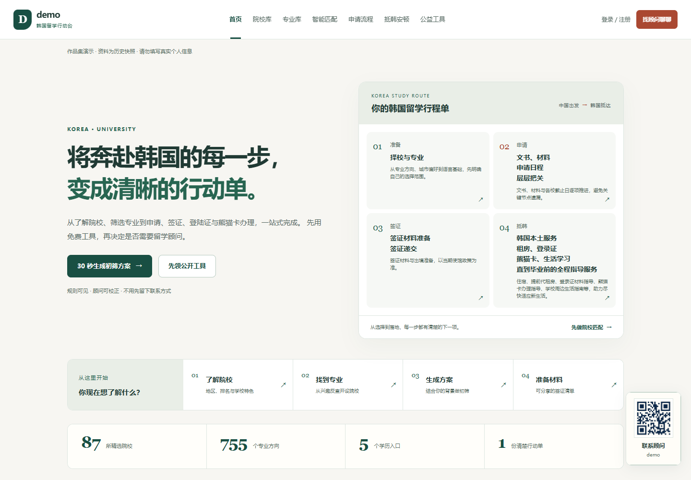
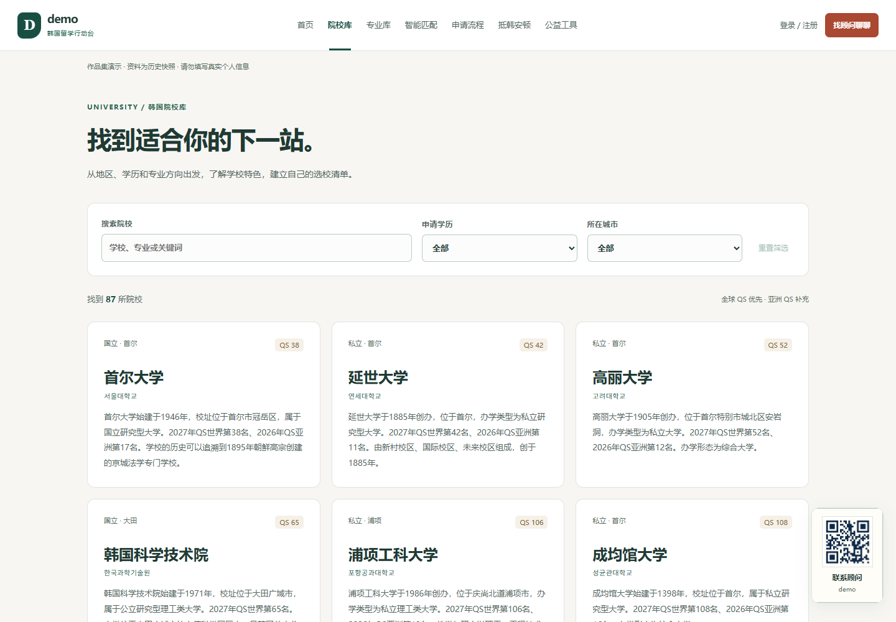

# demo Study | 韩国留学信息聚合平台

[中文](#中文) · [English](#english) · [한국어](#한국어)



## 中文

这是一个面向赴韩及在韩留学生的 Web 应用，提供韩国院校查询、专业检索、申请条件初筛和签证材料清单。V1 可在本机运行，包含学生端和内容管理后台。

### 💡 为什么做这个项目？

作为一名在韩国读计算机的中国留学生，我深知准备申请、办签证和各种证件有多折腾。招生要求散落在各个学校官网的角落里，同样的手续也会因为学历、个人身份或者办理地点的不同而变来变去。对于韩语还不太溜、又不熟悉当地办事流程的同学来说，光是搞清楚“我到底需要准备什么材料”就要掉不少头发。

所以我决定做这个网站，把这些碎片化的信息整合起来。用户可以根据自己的情况查学校、比专业，再查看对应路径的材料清单和办理步骤。目前基础查询工具免费开放，未来可能探索可选的付费增值服务来覆盖维护成本；V1 没有支付功能。

目前项目优先跑通中文用户的核心需求，至于数据的持续化更新和多语言支持，会在后续版本慢慢迭代。

### ✨ V1 实现了什么？

- 🏫 **院校查询**：支持按关键词、学历和城市筛选，默认按 QS 排名显示（每页 12 所）。
- 📚 **专业检索**：搜专业能直接反查出哪些学校开设；管理员在后台会把各校名称相近的专业做关联，但前端依然显示学校原本的专业名称，避免误导。
- ⚖️ **申请初筛**：根据你的均分、语言成绩和专业方向，系统会给一个大致的择校档位建议。注意：这只是基于硬性规则的匹配，不代表真实的录取概率，仅供参考。
- 📋 **材料清单**：涵盖本、硕、博以及语学院的签证申请材料。支持一键复制清单图片分享；如果浏览器限制复制，会自动降级为下载图片。
- ⚙️ **后台管理**：支持学校信息的批量上/下架、专业信息维护、Excel 导入导出，以及动态修改匹配规则和页面内容。

> **注**：演示库里有 261 所学校（前端展示 87 所）。数据仅为历史快照，真正申请时一定要去官网核对最新简章。顾问入口目前也是演示用的，不接收真实咨询。详见[资料说明](data/README.md)。


### 🛠️ 技术踩坑与架构说明

前端用的 React + TypeScript + Vite，后端是 Node.js。为了轻量化，V1 没上数据库，直接用 JSON 文件做数据存储。Excel 解析库做了按需加载，支持了市面上常见的大部分表格格式（XLSX, CSV, ODS 等）。

在做表格导入时遇到过几个坑：比如同名学校改简介的时候怎么同步、旧模板里的学校 ID 变了怎么办。所以我在导入逻辑里加了校名和 ID 核对，单校专业表也会检查归属，防止数据串门。

后台保存时我加了数据版本校验。如果遇到多人同时修改导致的冲突，页面会保留草稿，让管理员先导出自己的修改，刷新拉取新版本后再合并。服务端写文件用了队列和临时文件替换策略，不过目前只适用于单进程部署。

更详细的代码结构和技术取舍，可以看[架构说明](docs/ARCHITECTURE.md)。

### 🧪 测试

```sh
npm test
npm run test:coverage
npx playwright install chromium
npm run test:ui

```

直接跑 `npm run verify` 会依次检查格式、运行覆盖率测试、构建并执行浏览器 UI 测试。Windows 上有 Edge 的话会直接用 Edge，其他环境默认用 Playwright 的 Chromium。
测试覆盖了表格兼容性、权限控制、并发保存冲突以及核心页面的交互。测试数据和实际运行数据是完全隔离的，具体见 [TESTING.md](TESTING.md)。

### 🚧 待解决的坑 (TODO)

- 目前的文件存储机制只支持单进程，重启后 Session 会失效。
- 择校推荐的规则还比较粗糙，没法 100% 覆盖所有学校具体的特殊要求。
- 微信/手机端长图分享的兼容性还需要实机多测几次。
- 找回密码、操作日志追踪还没做。

总结：目前是本机测试跑通的 demo 版本，不能直接商用。




## English

A web app for prospective and current international students in South Korea. It brings together university and major search, rule-based application screening, and visa document checklists. V1 runs locally and includes a student site and an admin CMS.

### 💡 Why I built this

As a Chinese student studying Computer Science in Korea, I know firsthand how frustrating the application and visa processes can be. Admissions requirements are scattered across different university websites, and the required paperwork constantly changes depending on your educational background, visa status, or where you're applying. For students who aren't fully fluent in Korean or familiar with local procedures, simply figuring out _what_ to prepare takes way too much time.

I built this site to centralize all that scattered information. Users can input their background, search for schools, compare majors, and find the relevant document checklist and action steps. Core features are free. Down the line, I might explore optional premium features to help cover server and maintenance costs (though V1 has no payment integration yet).

Right now, the priority is to nail the core workflow for Chinese-speaking users. Automated data updates and multi-language support are planned for future iterations.

### ✨ What's in V1?

- 🏫 **University Search**: Filter by keyword, degree, and city. Sorted by QS rankings by default (12 per page).
- 📚 **Major Search**: Reverse-search which schools offer a specific major. Admins can link similarly-named majors in the backend, but the frontend strictly displays the official major name used by the university to avoid confusion.
- ⚖️ **Eligibility Check**: Get a rough recommendation on target schools based on your GPA, language scores, and major. _Note: This is based on configurable rules and does not guarantee admission._
- 📋 **Document Checklists**: Visa application requirements for Bachelor's, Master's, PhD, and Language School programs. You can copy the checklist as an image with one click (or download it if clipboard access is blocked).
- ⚙️ **Admin CMS**: Batch toggle school visibility, manage majors, import/export via Excel, and edit matching rules and page content dynamically.

> **Note**: The demo includes 261 schools (87 visible on the frontend). The data is a historical snapshot—always check the official university guidelines before applying. The "Consultant" feature is just a UI demo. See [Data Readme](data/README.md) for details.


### 🛠️ Architecture & Dev Notes

Built with React, TypeScript, Vite, and a Node.js backend. To keep V1 lightweight, it uses JSON files for storage instead of a database. The Excel parser is loaded on demand and supports XLSX, CSV, ODS, etc.

I ran into some real-world edge cases when building the spreadsheet import: e.g., how to handle updates if a school changes its bio, or if an old template uses an outdated School ID. To fix this, the import logic checks both school names and IDs, ensuring majors aren't accidentally assigned to the wrong university.

The CMS includes version control for saves. If there's a conflict (e.g., someone else updated the data), the UI saves your draft, prompts you to export your changes, fetch the latest version, and re-apply. File writing on the server uses a queue and temp-file replacement, though this is currently designed for a single-process setup.

For a deeper dive into the code structure, check out the [Architecture Docs](docs/ARCHITECTURE.md).

### 🧪 Testing

```sh
npm test
npm run test:coverage
npx playwright install chromium
npm run test:ui

```

Running `npm run verify` checks formatting and runs coverage, build, and browser tests. It uses Edge on Windows if available, otherwise Playwright Chromium. Tests cover Excel compatibility, auth checks, save conflicts, and core UI interactions. Test data is isolated from the sample site data. Details in [TESTING.md](TESTING.md).

### 🚧 Known Limitations (TODOs)

- The file storage only supports a single server process, and sessions drop on restart. Moving to a real DB is step one for a production release.
- The matching rules are a bit rigid right now and don't account for every quirky requirement some schools have.
- Image sharing needs more real-world testing on mobile devices and WeChat browsers.
- Password recovery, audit logs, and payments are out of scope for V1.


## 한국어

한국 유학을 준비하거나 현재 재학 중인 유학생들을 위한 웹 애플리케이션입니다. 대학 및 전공 검색, 규칙 기반 지원 조건 사전 확인, 비자 서류 체크리스트 등을 제공합니다. V1은 로컬 환경에서 실행할 수 있으며 학생용 웹과 관리자용 CMS를 포함합니다.

### 💡 프로젝트 시작 배경

한국에서 컴퓨터 공학을 전공하고 있는 중국인 유학생으로서, 저는 입학 지원과 비자 발급 과정이 얼마나 복잡한지 몸소 겪었습니다. 모집 요강은 학교 홈페이지마다 숨겨져 있고, 학력이나 체류 자격, 신청 장소에 따라 필요한 서류가 시시각각 달라집니다. 한국어나 현지 행정 처리에 익숙하지 않은 유학생들에게는 '도대체 뭘 준비해야 하는지' 파악하는 데만 엄청난 시간이 소요됩니다.

이러한 파편화된 정보들을 한곳에 모아보고자 이 사이트를 만들게 되었습니다. 사용자들은 자신의 상황에 맞춰 학교와 전공을 검색하고, 그에 맞는 해당 과정의 서류 체크리스트와 진행 절차를 한눈에 확인할 수 있습니다. 기본 검색 기능은 무료로 제공되며, 향후 서버 및 유지보수 비용을 충당하기 위해 선택적 유료 서비스 도입도 고민 중입니다 (현재 V1에는 결제 기능이 없습니다).

현재는 중화권 사용자를 타겟으로 핵심 프로세스를 구축하는 데 집중하고 있으며, 자동 데이터 업데이트나 다국어 지원은 추후 버전에서 개선할 계획입니다.

### ✨ V1 주요 기능

- 🏫 **대학 검색**: 키워드, 학위 과정, 지역별 필터링을 지원하며 기본적으로 QS 순위 기준으로 정렬됩니다 (페이지당 12개교).
- 📚 **전공 검색**: 특정 전공을 개설한 대학을 역추적하여 검색할 수 있습니다. 관리자는 백엔드에서 유사한 이름의 전공들을 매핑할 수 있지만, 사용자에게 혼란을 주지 않기 위해 프론트엔드에서는 각 대학의 공식 전공 명칭을 그대로 표시합니다.
- ⚖️ **지원 자격 진단**: 평균 학점(GPA), 어학 성적, 희망 전공을 바탕으로 지원 가능한 대학 수준을 대략적으로 추천해 줍니다. _주의: 이는 단순 규칙 기반 매칭이므로 실제 합격률을 보장하지 않습니다._
- 📋 **서류 체크리스트**: 학사, 석사, 박사 및 어학당 비자 신청에 필요한 서류 목록을 제공합니다. 클릭 한 번으로 체크리스트를 이미지로 복사할 수 있으며, 브라우저가 지원하지 않을 경우 자동 다운로드로 대체됩니다.
- ⚙️ **관리자 CMS**: 학교 정보 일괄 공개/비공개 처리, 개별 전공 관리, 엑셀 가져오기/내보내기, 매칭 규칙 및 페이지 콘텐츠 동적 수정이 가능합니다.

> **참고**: 데모 버전에는 261개 대학이 포함되어 있으며(프론트엔드 노출 87개), 해당 데이터는 과거 기준이므로 실제 지원 시에는 반드시 공식 모집 요강을 확인해야 합니다. 상담사 연결 기능은 UI 데모일 뿐 실제 상담을 지원하지 않습니다. 자세한 내용은 [데이터 설명서](data/README.md)를 참고하세요.

### 🛠️ 아키텍처 및 개발 리뷰

프론트엔드는 React + TypeScript + Vite, 백엔드는 Node.js로 구축했습니다. V1을 가볍게 유지하기 위해 별도의 데이터베이스 없이 JSON 파일로 데이터를 관리합니다. Excel 파싱 라이브러리는 필요할 때만 로드되며 XLSX, CSV, ODS 등 다양한 형식을 지원합니다.

엑셀 데이터 임포트 기능을 구현하면서 몇 가지 현실적인 문제에 부딪혔습니다. 예를 들어, 동명 대학의 소개글 수정 시 동기화 문제나, 구형 템플릿의 ID 충돌 문제 등이 있었습니다. 이를 방지하기 위해 임포트 과정에 학교명과 ID를 함께 확인하는 로직을 추가했습니다.

저장 시 데이터 버전 충돌 방지 기능도 구현했습니다. 여러 명이 동시에 수정하여 충돌이 발생하면, 현재 작성 중인 내용을 임시 저장한 뒤 내보내기를 유도하여 최신 데이터를 다시 불러온 후 병합하도록 설계했습니다. 서버의 파일 쓰기는 큐(Queue)와 임시 파일 교체 방식을 사용하지만, 현재는 단일 프로세스 환경에만 적합합니다.

코드 구조와 기술적 의사결정에 대한 자세한 내용은 [아키텍처 문서](docs/ARCHITECTURE.md)를 확인하세요.

### 🧪 테스트

```sh
npm test
npm run test:coverage
npx playwright install chromium
npm run test:ui

```

`npm run verify`를 실행하면 코드 형식을 확인하고 커버리지 검사, 빌드 및 브라우저 UI 테스트를 진행합니다. 테스트는 엑셀 호환성, 권한 제어, 저장 충돌 처리, 핵심 페이지 UI 상호작용 등을 포괄합니다. 테스트 데이터는 예시 사이트 데이터와 분리되어 있습니다. 상세 내용은 [TESTING.md](TESTING.md)를 참조하세요.

### 🚧 보완해야 할 점 (TODO)

- 현재의 파일 저장 방식은 단일 프로세스만 지원하며 서버 재시작 시 세션이 초기화됩니다. 실제 서비스 배포를 위해서는 데이터베이스 도입이 1순위입니다.
- 추천 로직이 아직 정교하지 않아, 일부 대학의 독특한 입시 요강을 100% 반영하지 못하고 있습니다.
- 모바일 기기 및 위챗(WeChat) 내장 브라우저에서의 이미지 캡처/공유 기능 호환성 테스트가 더 필요합니다.
- 비밀번호 찾기, 관리자 작업 로그 추적 기능 등은 V1에서 제외되었습니다.

