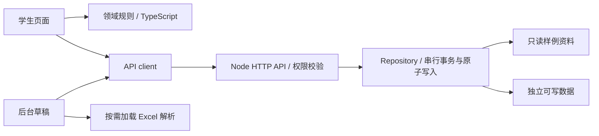

# 架构与取舍

## 要解决的问题

院校与专业维护的难点不在于画出列表，而在于旧表格格式不一致、同名校被误判成新校、相似专业不能随便合并，以及后台编辑和前台展示容易脱节。项目把这些规则从页面中抽出，让 UI 只负责收集条件、显示结果和编辑草稿。

## 代码组织

| 层         | 位置                                      | 职责                                                  |
| ---------- | ----------------------------------------- | ----------------------------------------------------- |
| 启动与导航 | `src/main.tsx`、`src/App.tsx`、`src/app`  | 装配页面、登录状态、按页面懒加载                      |
| 领域规则   | `src/domain`                              | QS 排序、学历归一化、专业目录和推荐评分，不依赖 React |
| 页面       | `src/pages`                               | 学生端各条任务路径                                    |
| 后台       | `src/features/admin`                      | 学校、单校专业、人工专业关联、规则和资料维护          |
| 通用能力   | `src/lib`、`src/ui`、`src/components`     | API、表格、分享卡、弹窗焦点和分页                     |
| 样式       | `src/styles`                              | 按页面职责分文件，主题变量集中在 theme.css            |
| 服务端     | `server/app.mjs`、`server/repository.mjs` | HTTP 边界、角色权限、版本冲突和文件事务               |

## 为什么保留轻量服务端

V1 先把数据查询和后台维护做通，因此使用不需要额外安装的 JSON 文件存储。所有读改写进入同一个队列，写入先落临时文件再替换，防止同时保存或提交咨询互相覆盖。

这不是多实例数据库事务。多个 Node 进程共享同一数据文件、分布式会话和高并发都不在支持范围内。需要上线时应将 Repository 替换为带事务和版本号的数据库实现，而不是把本地文件服务直接暴露到公网。

## 保存与权限

- 匿名用户和普通用户只能读取公开内容，咨询线索不会从公开 API 返回。
- 内容保存需要服务端核验管理员会话；前台是否显示按钮不作为授权依据。
- 注册接口始终创建普通用户；保留管理员用户名，密码使用 scrypt 加盐处理。
- 会话仅保存在服务进程内，八小时过期，重启失效；登录失败有基础限流。
- 管理员密码来自环境变量；未配置时每次启动随机生成。不提供源码内的默认密码。
- 保存携带 `meta.updatedAt` 版本，旧版本返回 409；CMS 不能用旧快照清空咨询线索。
- 静态服务只允许读取 `dist/`，不提供源码、工作目录和私人资料的兜底访问。

## 推荐系统的边界

这是可解释的规则初筛，不调用大模型，不预测录取概率。学历、均分、语言、专业方向、城市、预算、背景和经历影响匹配评分；学校难度档位使用排名作为启发式参照。后台可修改院校范围及参考门槛。

冲刺、稳妥、保底是候选组合的相对分档，匹配分也不是录取率。当前算法没有把每所学校、每个专业的真实录取条件完全编码，仍需要核对当期简章中的具体要求。

## 专业关联

相似度仅用于后台提供候选。只有管理员确认的别名组才合并展示；同名专业直接汇总，近似名称不会自动合并。同一别名出现在多组时首组获得归属，防止结果重复。

## 性能与多端

- 非首页页面、后台、Excel 主库与编码表分别懒加载；浏览首页不会加载表格解析包。
- 专业归组使用 Map 索引，避免每个组反复遍历全量记录；专业目录每页 30 条，学校列表每页 12 条。
- 不加载远程字体；适配 390、768、1440 像素视口。界面仍以桌面管理效率为主要目标。
- 公共资料、推荐规则和 API 与 DOM 分离，后续小程序可复用模型和接口，但 React 组件不能直接作为原生小程序 UI 使用。

## 需要生产化时再做

数据库及迁移、服务端 schema 全量校验、操作审计与恢复、HTTPS、HttpOnly Cookie 和 CSRF 策略、持久化会话、密码找回、咨询反垃圾、上传配额和隐私合规。当前 localStorage 会话与文件存储只用于作品集/本机演示。
